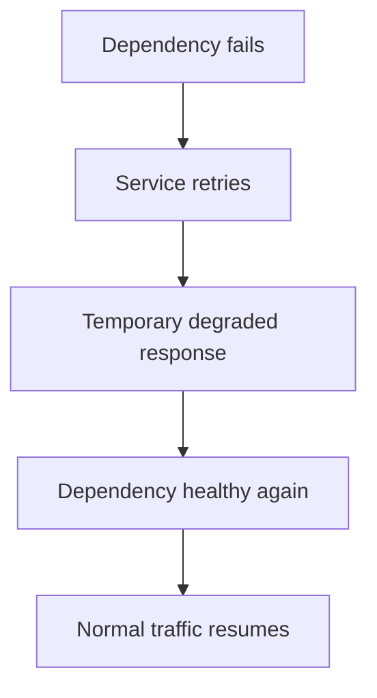
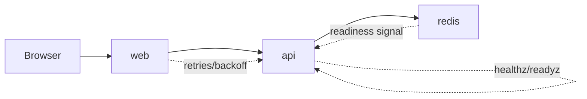

# 08 Resilience

<div class="text-2xl opacity-70 mt-6">
From "it starts" to "it starts reliably"
</div>

---
class: text-2xl
---

# Part 1: Where We Left Off

Last lecture we built:

- `web` (Express)
- `api` (Express)
- Service-name networking (`web` -> `api`)

Today we make the system robust during startup and restart.

---
class: text-2xl
layout: two-cols
layoutClass: gap-12
---

# What Is Resilience

<div class="rounded-xl border border-gray-300 p-5 bg-white/60">
  <div class="text-4xl font-bold leading-tight">Take a hit. Keep going.</div>
  <p class="mt-4">
    Resilience means a system can keep working even when some services are slow,
    restart, or temporarily fail.
  </p>
</div>

::right::

<v-clicks class="mt-10">

- In microservices, failures are normal, not rare.
- Resilient systems avoid all-at-once crashes.
- They retry, report health, and recover when dependencies return.
- Goal: degrade gracefully, then recover automatically.

</v-clicks>

---
class: text-2xl
layout: two-cols
layoutClass: gap-24
---

# What Is Resilience

<div class="rounded-xl border border-gray-300 p-5 bg-white/60">
  <div class="text-4xl font-bold leading-tight">Take a hit. Keep going.</div>
  <p class="mt-4">
    Resilience means a system can keep working even when some services are slow,
    restart, or temporarily fail.
  </p>
</div>

::right::

<div class="pb-8">



</div>

---
class: text-2xl
---

# Goals

- Understand startup order vs readiness
- Add explicit readiness/health endpoints
- Use Compose health checks for better visibility
- Add retry/backoff so transient failures do not crash the app

**In simple terms:** we are making the system less fragile. If one service is slow or briefly down, the whole app should not collapse. Services should report their status clearly, wait when needed, and recover automatically.

**This is one of the most fundamental features every service should have.**

---
class: text-2xl
---

# Why This Matters

In distributed systems, failures often happen at startup.

Failures are many, including:

- Dependency not ready yet
- Slow boot on one service
- Race conditions between services

If boot is fragile, local development and deployments both become noisy.

---
class: text-2xl
layout: two-cols-header
layoutClass: gap-12 no-wrap-header
---

# Dependency Not Ready Yet

::left::

<Callout title="Started is not the same as ready." tone="info">
  Your service can be running, but its dependency may still be booting.
</Callout>

::right::

**What this means:**

- `web` calls `api` immediately
- `api` tries Redis immediately
- Redis has not finished startup yet
- First requests fail (`ECONNREFUSED`, `503`, timeout)

---
class: text-2xl
layout: two-cols-header
layoutClass: gap-12 no-wrap-header
---

# Slow Boot on One Service

::left::

<Callout title="One slow service can delay the whole chain." tone="warning">
  Even healthy code fails if a dependency takes longer than expected.
</Callout>

::right::

**What this means:**

- Most services are up quickly
- One dependency needs extra startup time
- Upstream requests hit it too early
- You see flaky startup behavior across runs

---
class: text-2xl
layout: two-cols-header
layoutClass: gap-12 no-wrap-header
---

# Race Conditions Between Services

::left::

<Callout title="Order is not enough when events overlap." tone="warning">
  Two services can each be "up" but still not synchronized.
</Callout>

::right::

What this means:

- Service A checks Service B once
- Service B restarts or reconnects at the same time
- A request lands in that transition window
- Behavior is inconsistent and hard to reproduce

---
class: text-2xl
---

# Mental Model: Started vs Ready

- **Started**: process exists
- **Ready**: service can correctly handle requests

A container can be "up" and still not be safe to call.

This distinction is the core of today's lecture.

---
class: text-2xl
---

# Quick Vocabulary

- **Liveness**: should this process keep running?
- **Readiness**: can this service handle traffic now?
- **Health check**: repeated probe to infer health state
- **Retry with backoff**: controlled retries with increasing delay

<Callout class="mt-6 mb-8" 
         title="Order is not enough when events overlap." 
         tone="warning">
In short, these four ideas help us build services that are stable under real-world conditions. They let us detect problems early, avoid sending traffic at the wrong time, and recover from temporary failures without taking down the whole system.
</Callout>

---
class: text-2xl
---

# End-State Preview


Boot-stability additions:

- readiness endpoints (`/healthz`, `/readyz`)
- Compose health checks
- retries in dependency calls

---
class: text-2xl
---

# Command Preview

Recall the following commands:

- `docker compose up --build` → reproduce startup behavior
- `docker compose ps` → observe current container states
- `docker compose logs -f web api redis` → correlate boot timing
- `docker compose restart redis` → inject dependency disruption
- `docker compose exec api wget -qO- http://redis:6379` 
  <br> (or app-specific probe)

---
class: text-2xl
---

# Redis Primer: What Is Redis?

- [Redis](https://redis.io/) is an in-memory key-value data store
- Very fast reads/writes for small pieces of shared state
- Common uses: cache, counters, lightweight queues, sessions
- Data structures include strings, hashes, lists, sets, sorted sets

For us today: Redis is a small, shared dependency that helps expose startup/race issues.

---
class: text-2xl
---

# Why We Use Redis

- Adds a real dependency for `api` to wait on
- Lets us demonstrate readiness vs process startup
- Makes failure injection meaningful (`restart redis`)
- Gives us concrete state checks during debugging (`GET`, `INCR`)

Redis is not the end goal; it is a controlled way to study system behavior.

<Callout class="mt-6 mb-8" 
         title="Why Redis?" 
         tone="warning">
It is fast, simple, and easy to run in Docker Compose, which makes it perfect for testing readiness checks, health checks, retries, and recovery when a service restarts.
</Callout>

---
class: text-2xl
---

# Run Redis with Compose

It is very easy to run Redis in Docker

`compose.yml` service:

```yaml
services:
  redis:
    image: redis:7-alpine
    ports:
      - '6379:6379'
```

Start it with the rest of the stack:

- `docker compose up -d redis`
- or `docker compose up -d`

---
class: text-2xl
---

# Connect to Redis (`redis-cli`)

Redis provides a CLI to connect to the server. This allows you to run commands to store and retrieve data.

**Option 1 (inside compose service):**

*This is the easiest and recommended way to do this.*

- `docker compose exec redis redis-cli`

**Option 2 (ephemeral container on same network):**

- `docker run --rm -it --network <project>_default redis:7-alpine redis-cli -h redis`

Exit CLI with `quit`.

---
class: text-2xl
---

# First Commands in `redis-cli`

```bash
PING
SET course "cs426"
GET course
INCR visits
INCR visits
GET visits
KEYS *
```

Expected:

- `PING` -> `PONG`
- `GET course` -> `"cs426"`
- `visits` increments as a string integer

---
class: text-2xl
---

# From App to Redis

In app code, use service-name DNS on the Compose network:

- host: `redis`
- port: `6379`
- example URL: `redis://redis:6379`

If `api` uses `localhost:6379`, it will fail inside Compose unless Redis runs in the same container.

<Asciinema src="/casts/01-redis.cast" theme="dracula" rows="7"/>

---
class: text-2xl
---

# Part 2: Readiness in Application Code

- Add explicit health endpoints first
- Keep implementation simple and observable
- Avoid pretending "ready" before dependencies are actually reachable

---
class: text-2xl
---

# Part 2 Goals

- Add `/healthz` (process alive)
- Add `/readyz` (dependency ready)
- Return fast, machine-readable responses
- Keep checks deterministic

---
class: text-xl
---

# Example: `api/server.js` Endpoints

<div class="max-h-[460px] overflow-y-auto pr-2">

```js
import express from 'express'
import redis from 'redis'

const app = express()
const client = redis.createClient({ url: process.env.REDIS_URL })

let redisReady = false
client.on('ready', () => { redisReady = true })
client.on('end', () => { redisReady = false })
client.connect().catch(() => {})

app.get('/healthz', (_req, res) => {
  res.status(200).json({ status: 'ok' })
})

app.get('/readyz', (_req, res) => {
  if (!redisReady) return res.status(503).json({ status: 'not-ready' })
  res.status(200).json({ status: 'ready' })
})
```

</div>

---
class: text-2xl
---

# Endpoint Design Rules

- `/healthz` should be cheap and stable
- `/readyz` can include dependency checks
- Return status code + short JSON payload
- Do not put heavy business logic in probes

---
class: text-2xl
---

# Quick Test Plan

- `curl http://localhost:3000/healthz`
- `curl http://localhost:3000/readyz`
- Stop dependency (`redis`) and test `/readyz` again

Expected:

- `/healthz` stays `200` while process runs
- `/readyz` switches to `503` if dependency unavailable

<Asciinema src="/casts/02-quick-test-plan.cast" theme="dracula" rows="7"/>

---
class: text-2xl
---

# Demo: Observe Boot Sequence

- Start stack: `docker compose up --build`
- In another terminal: `docker compose logs -f web api redis`
- Watch first successful `/readyz` response timing

---
class: text-2xl
---

# Part 3: Compose Health Checks

- App endpoints are necessary
- Compose checks make state visible at container level
- Together they improve diagnostics during startup

---
class: text-2xl
---

# Part 3 Goals

- Add `healthcheck` block in `compose.yml`
- Track `starting`, `healthy`, `unhealthy`
- Tune intervals/retries for local development

---
class: text-2xl
---

# `compose.yml` Health Check Example

```yaml
services:
  api:
    build: ./api
    ports:
      - '3000:3000'
    healthcheck:
      test: ['CMD', 'wget', '-qO-', 'http://localhost:3000/readyz']
      interval: 5s
      timeout: 2s
      retries: 10
      start_period: 10s
```

---
class: text-2xl
---

# Reading Health States

`docker compose ps` may show:

- `Up 10 seconds (health: starting)`
- `Up 40 seconds (health: healthy)`
- `Up 1 minute (health: unhealthy)`

Use this before diving into code-level debugging.

---
class: text-2xl
---

# Demo: Health Status in Action

- Run: `docker compose ps`
- Follow with: `docker compose logs -f api`
- Compare endpoint readiness and health transitions

<!-- <Asciinema src="/casts/05-health-check.cast" :rows="6" /> -->

---
class: text-2xl
---

# Common Health Check Mistakes

- Probing wrong port inside container
- Using `localhost` incorrectly across services
- Timeouts too aggressive for cold starts
- Assuming `depends_on` alone means "ready"

---
class: text-2xl
---

# Part 4: Startup Order vs Readiness

`depends_on` controls startup ordering.

It does **not** guarantee a dependency is ready to serve requests unless you use health-based conditions and resilient app code.

---
class: text-2xl
---

# Safer `depends_on` Pattern

```yaml
services:
  web:
    build: ./web
    depends_on:
      api:
        condition: service_healthy
```

This helps, but you still need retries in real request paths.

---
class: text-2xl
---

# Failure Injection Demo

- Start healthy stack
- `docker compose restart redis`
- Observe `api` and `web` logs during recovery
- Refresh browser repeatedly

Goal: see whether system degrades gracefully or crashes.

---
class: text-2xl
---

# Part 5: Retries with Backoff

- Keep service running through transient dependency failures
- Retry a few times before returning 503/500
- Use bounded, visible retry logic

---
class: text-2xl
---

# Part 5 Goals

- Add retry wrapper for dependency calls
- Use increasing delays (backoff)
- Log attempts for debugging
- Avoid infinite retry loops

---
class: text-2xl
---

# Minimal Retry Helper (Node)

```js
const sleep = (ms) => new Promise((r) => setTimeout(r, ms))

async function withRetry(fn, attempts = 4, baseMs = 100) {
  let lastError
  for (let i = 0; i < attempts; i += 1) {
    try {
      return await fn()
    } catch (err) {
      lastError = err
      const delay = baseMs * (2 ** i)
      await sleep(delay)
    }
  }
  throw lastError
}
```

---
class: text-2xl
---

# Using Retry in `web`

```js
app.get('/', async (_req, res) => {
  try {
    const data = await withRetry(async () => {
      const r = await fetch('http://api:3000/readyz')
      if (!r.ok) throw new Error('api not ready')
      return r.json()
    })
    res.status(200).json({ ok: true, api: data })
  } catch {
    res.status(503).json({ ok: false, message: 'dependency unavailable' })
  }
})
```

---
class: text-2xl
---

# Observability Checkpoint

When things fail, inspect in this order:

1. `docker compose ps`
2. `docker compose logs -f <service>`
3. `curl /healthz` and `/readyz`
4. `docker compose exec <service> sh` for in-container checks

Use a repeatable order to avoid random debugging.

---
class: text-2xl
---

# Quick Test (Stability)

- Bring stack up
- Restart dependency while traffic is active
- Verify app recovers without manual rebuild

Success looks like:

- brief degraded responses
- eventual healthy state restoration
- no permanent crash loop

---
class: text-2xl
---

# Common Mistakes (Today)

- Returning `200` from `/readyz` unconditionally
- Health check command missing in container image
- No backoff (tight retry loops)
- Treating startup failures as fatal when retries are enough

---
class: text-2xl
---

# Part 5 Wrap-Up



- Startup order and readiness are different concerns
- Health checks improve visibility
- Retries improve resilience
- This is the foundation for worker/queue patterns next

---
layout: two-cols-header
layoutClass: gap-8 compact-header
class: text-lg
---

## In-Class Exercise (~15 minutes)

::left::

Use this folder: `lectures/08-resilience/code`

Do exactly this:

1. Start stack: `docker compose up -d --build`
2. Verify healthy:
   - `docker compose ps`
   - `curl http://localhost:3000/readyz`
   - `curl http://localhost:3001`
3. Inject failure: `docker compose restart redis`
4. While Redis restarts, run `curl http://localhost:3001` a few times and watch response changes.

::right::

5. In `web/server.js`, change retry settings to `attempts = 6` and `baseMs = 200`. Rebuild web: `docker compose up -d --build web`
6. Repeat step 3 and compare behavior.

Submit:

- One screenshot of `docker compose ps`
- One before/after note (2-3 sentences): "Did higher retry/backoff reduce visible failures?"

---
class: text-2xl
---

# Stretch Goal (If Finished Early)

- Add a `worker` service that polls Redis every few seconds
- Give worker its own `/healthz` endpoint (or equivalent heartbeat logs)
- Restart `api` and verify worker remains stable

---
class: text-2xl
---

# Next Time

- Introduce a dedicated background worker
- Queue-based communication patterns
- Failure isolation between request path and async work
- Idempotency and at-least-once processing tradeoffs
