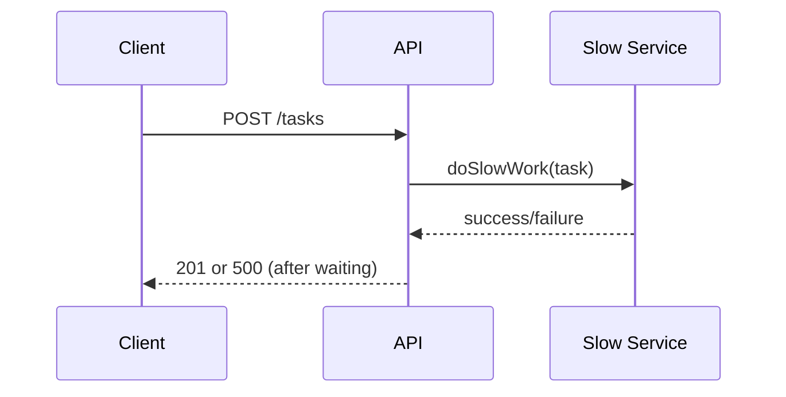

# Slide Formatting Tips

## Code Font Size (Global + Per-Slide)

Code font sizing is controlled in [`styles.css`](./styles.css) using CSS variables.

Global defaults:

```css
:root {
  --deck-code-font-size: 1.2rem;
  --deck-code-line-height: 1.45;
  --deck-monaco-font-size: 22px;
}
```

To change code size for the entire deck, edit those values once.

Per-slide overrides are available with frontmatter classes:

- `code-size-sm`
- `code-size-md`
- `code-size-lg`

Example:

```md
---
class: text-xl code-size-sm
---
```

This changes code size on that slide only.

## Mermaid Diagram Size (Per-Slide)

To make a Mermaid diagram smaller, wrap it in a width-constrained container.

Example:

```md
<div class="w-3/4 mx-auto">



</div>
```

Useful width classes:

- `w-3/4`
- `w-2/3`
- `w-1/2`

### Vertical Centering (Two-Column Layouts)

In `two-cols-header`, `h-full` is often not enough to center Mermaid vertically.

Use a fixed/min-height wrapper:

```md
::right::

<div class="min-h-[380px] grid place-items-center">


</div>
```

If needed, force right-column centering with slide-scoped style:

```md
---
layout: two-cols-header
class: mermaid-vertical-center
---

<style>
.mermaid-vertical-center .col-right {
  display: flex;
  align-items: center;
  justify-content: center;
}
</style>
```

### Making Mermaid Bigger

Quick per-slide approach:

```md
<div class="origin-center scale-125 overflow-visible">


</div>
```

Try:

- `scale-110`
- `scale-125`
- `scale-150`

Reusable CSS approach in `styles.css`:

```css
.mermaid-lg .mermaid {
  transform: scale(1.25);
  transform-origin: center;
}
```

Then use on a slide:

```md
---
class: mermaid-lg
---
```

## Two-Column Gap Control

Set column spacing with `layoutClass` on `two-cols` or `two-cols-header`.

Basic example:

```md
---
layout: two-cols
layoutClass: gap-12
---
```

If you want only space between left/right columns (not vertical row gap):

```md
---
layout: two-cols
layoutClass: gap-x-12 gap-y-0
---
```

Same pattern for `two-cols-header`:

```md
---
layout: two-cols-header
layoutClass: gap-x-12 gap-y-0
---
```
