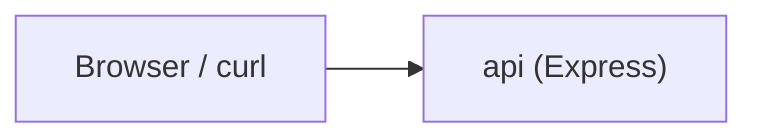
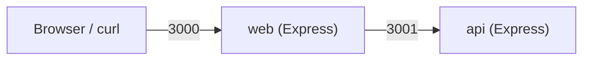
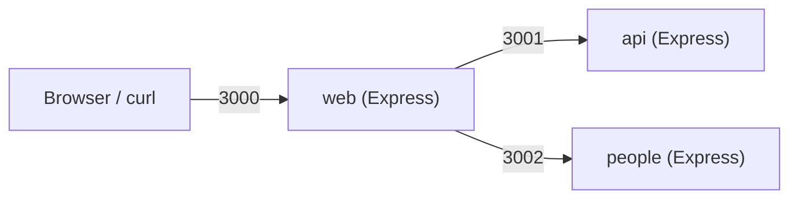

# 07 Docker Compose

<div class="text-2xl opacity-70 mt-6">
A Step-by-Step Approach
</div>

---
class: text-2xl
---

# Part 1: Why Docker Compose?

- Goal: understand the mental model before we start coding
- We will build a small multi-service app step by step
- Focus today: practical commands and debugging workflow

---
class: text-2xl
---

# Goals (Part 1)

- Understand what Compose manages
- Know the difference between image, container, and service
- See why Compose is useful for multi-service apps
- Preview the app we will build in this lecture

---
class: text-2xl
---

# Compose Mental Model

- `compose.yml` describes your application
- A **service** is one role in your app (example: `api`, `web`, `redis`)
- `docker compose up` creates/runs containers for those services
- Compose also creates a network so services can talk to each other

---
class: text-2xl
---

# Key Terms

- **Image**: template used to create a container
- **Container**: running instance of an image
- **Service**: Compose definition for one container role
- **Project**: the group of services managed together by Compose
- **Volume**: persistent storage used by containers

---
class: text-2xl
---

# Why Not Just `docker run`?

- `docker run` is fine for one container
- Multi-service apps need lots of flags (ports, env vars, networks, names)
- Hard to remember and hard to share with teammates
- Compose gives you one versioned config file and repeatable commands

---
class: text-2xl
---

# Why This Lecture Matters

- Compose gives us the same mini-system setup on every student machine
- We can add services gradually and observe how the whole system changes
- We can restart or break one service and study the impact on others
- Later topics (Redis, workers, failures, state) reuse this exact workflow

**Compose is our local systems laboratory.**

Today is foundation work for the systems questions we care about.

---
class: text-2xl
---

# What We Will Build (Preview)

A two-service system to start.

- `web` (Express)
- `api` (Express)

**Flow:**

- browser → `web`
- `web` → `api`
- Next time: `api` → `redis`

---
class: text-2xl
---

# Command Preview

Having a solid grasp of the `docker compose` commands will allow you to work with multi-service systems with ease. In this course, these commands are not the end goal; they are the tools we use to inspect and experiment on systems.

- `docker compose up --build` → "Can I reproduce the system?"
- `docker compose ps` → "What is running/exposed?"
- `docker compose logs -f api` → "Where is the failure"
- `docker compose exec web sh` → "Can services reach each other?"
- `docker compose down` → "Can the system shutdown gracefully?"
- `docker compose restart` → "How does one service failure affect others?"

We will take a look at these as we start putting together some services.

---
class: text-2xl
---

# Part 2: First Service (`api`)

- Build one small Express app first
- Put it in a container
- Run it with Docker Compose
- Learn the basic `up / ps / logs / down` workflow

---
class: text-2xl
---

# Part 2 Goals

- Create a minimal Express `api`
- Add a simple `Dockerfile`
- Add a minimal `compose.yml` with one service
- Start and inspect the service with Compose commands

---
class: text-2xl
---

# Minimal Express API (Example)

- `GET /` returns JSON
- Keep the code tiny so we can focus on Compose

Example response:

- `{ "message": "hello from api" }`

---
class: text-2xl
---

# System Structure

Our system will have the following directory layout:

```bash
.
├── api/          # code and config for api service
├── web/          # code and config for web service
└── compose.yml   # compose file to boot up the system
```

---
class: text-2xl
---

# Suggested `api` Files

```bash
api/
├── package.json
├── server.js
└── Dockerfile
```

This is enough for the first Compose demo.

We use JavaScript for simplicity.

---
class: text-2xl
---

# `api/server.js`

```js
import express from 'express';

const app = express()
const port = 3000

app.get('/', (req, res) => {
  res.json({ message: 'hello from api' })
})

app.listen(port, () => {
  console.log(`API listening on port ${port}`)
})
```

---
class: text-2xl
---

# `api/package.json`

```json
{
  "name": "api",
  "version": "1.0.0",
  "description": "",
  "type": "module",
  "main": "index.js",
  "scripts": { "start": "node server.js" },
  "keywords": [],
  "author": "",
  "license": "ISC",
  "dependencies": {
    "express": "^5.2.1"
  }
}

```

---
class: text-2xl
---

# Minimal `Dockerfile` (API)

- Use a Node base image
- Copy package files and install dependencies
- Copy app code
- Start the server

---
class: text-2xl
---

# `api/Dockerfile` (Contents)

```dockerfile
FROM node:25-alpine           # Base Node.js Image
WORKDIR /app                  # Create /app in image; cd to /app
COPY package*.json ./         # Copy package*.json files into /app
RUN npm install               # Install dependencies
COPY . .                      # Copy the rest into image
EXPOSE 3000                   # Hint that this service uses port 3000
CMD ["npm", "start"]          # Run the server
```

---
class: text-2xl
---

# Minimal `compose.yml` (One Service)

- One service: `api`
- Build from `./api`
- Map port `3000:3000`

Key idea:

- Compose service name is `api`

---
class: text-2xl
---

# `compose.yml` (Contents)

```yaml
services:
  api:
    build: ./api
    ports:
      - "3000:3000"
```

To boot this system:

```bash
docker compose up
```

---
class: text-2xl
---

# Boot System #1: `docker compose up`

<Asciinema src="/casts/01-compose-up" :rows="16" />


---
class: text-2xl
---

# First Commands to Demo

- `docker compose up --build`: rebuilds all images before boot up
- `docker compose up -d`: compose services in detached mode
- `docker compose ps`: show service containers under this compose
- `docker compose logs -f api`: streams api service log
- `docker compose down`: stops all containers and removes them

We will look at these in the order above.

---
class: text-2xl
---

# What `up --build` Is Doing

- Builds the API image (from `api/Dockerfile`)
- Creates the `api` container
- Starts the container
- Attaches logs to your terminal (unless `-d`)

<Asciinema src="/casts/02-compose-up-build" :rows="10" />

---
class: text-2xl
---

# What to Point Out in `ps`

- Service name (`code-api-1`)
- Container status (`running`, `exited`)
- Port mapping (`0.0.0.0:3000->3000/tcp`)

This is a quick way to test the health of your system.

<Asciinema src="/casts/03-compose-ps" :rows="20" />

---
class: text-2xl
---

# What to Point Out in `logs`

- App startup line (example: "Server listening on 3000")
- Request logs after hitting `GET /`
- How logs help debug "it started but doesn't work"

<Asciinema src="/casts/04-compose-logs" :rows="20" />

---
class: text-2xl
---

# Quick Test

- Open browser: `http://localhost:3000`
- Or run: `curl http://localhost:3000`

JSON response expected from the API service:
```json
{ 'message': 'hello from api' }
```

<Asciinema src="/casts/05-health-check" :rows="10" />

---
class: text-2xl
---

# Common Mistakes

- App listens on wrong port inside container (check log)
- Wrong `CMD` in `Dockerfile` (check log)
- Forgot `--build` after changing Dockerfile/dependencies (rebuild)
- Port `3000` already in use on host (Error: `EADDRINUSE` for Node)

---
class: text-2xl
---

# Part 2 Wrap-Up



- We now have one Express service running with Compose
- We know the basic lifecycle commands
- Next: add a second service (`web`) and service-to-service networking

---
class: text-2xl
---

# Part 3: Add `web` Service

- Add a second Express service: `web`
- `web` will call `http://api:3000`
- Show Compose networking by service name
- Introduce `exec` and `restart`

---
class: text-2xl
---

# Part 3 Goals

- Add `web` to `compose.yml`
- Run both services together
- Demonstrate service-name DNS (`api`)
- Use `docker compose exec web sh`
- Use `docker compose restart api`

---
class: text-2xl
---

# Updated System (Part 3)



- Browser talks to `web`
- `web` talks to `api` using the service name

---
class: text-2xl
---

# Suggested `web` Files

```bash
web/
├── package.json
├── server.js
└── Dockerfile
```

This mirrors the `api/` service structure.

---
class: text-2xl
---

# `web/server.js` (Contents)

````md magic-move

```js
import express from 'express'
```

```js
import express from 'express'

const app = express()
const port = 3001
```

```js
import express from 'express'

const app = express()
const port = 3001

app.get('/', async (req, res) => {

})

app.listen(port, () => {
  console.log(`Web listening on port ${port}`)
})
```

```js
import express from 'express'

const app = express()
const port = 3001

app.get('/', async (req, res) => {
  // The fetch() function sends HTTP requests (defaults to GET).
  // The general form of the function is:
  //   fetch(URL, params)
  const response = await fetch('http://api:3000')
  // Note the use of "api" as the domain name! Thank you Docker.
})

app.listen(port, () => {
  console.log(`Web listening on port ${port}`)
})
```

```js
import express from 'express'

const app = express()
const port = 3001

app.get('/', async (req, res) => {
  // The fetch() function sends HTTP requests (defaults to GET).
  const response = await fetch('http://api:3000')
  const data = await response.json()
  // We use await for both calls as they are asynchronous calls
})

app.listen(port, () => {
  console.log(`Web listening on port ${port}`)
})
```

```js
import express from 'express'

const app = express()
const port = 3001

app.get('/', async (req, res) => {
  const response = await fetch('http://api:3000')
  const data = await response.json()
  // We respond with some simple HTML
  res.send(`<h1>Web</h1><pre>${JSON.stringify(data, null, 2)}</pre>`)
})

app.listen(port, () => {
  console.log(`Web listening on port ${port}`)
})
```
````

---
class: text-2xl
---

# `web/Dockerfile` (Contents)

```dockerfile {1-7|6}
FROM node:25-alpine
WORKDIR /app
COPY package*.json ./
RUN npm install
COPY . .
EXPOSE 3001
CMD ["npm", "start"]
```

<v-click at="+0">

**NOTE:** This `Dockerfile` is identical as the one for the `api` service. The only real difference here is the port `3001` used by the `EXPOSE` directive.

</v-click>

---
class: text-2xl
---

# `compose.yml` (Two Services)

```yaml
services:
  api:
    build: ./api
    ports:
      - "3000:3000"

  web:
    build: ./web
    ports:
      - "3001:3001"
```

- Not much difference between the two service definitions.
- This is not always the case.

---
class: text-2xl
---

# Key Concept: Service Name DNS

- `web` can call `http://api:3000`
- `api` is the Compose service name
- No hard-coded IP addresses needed
- No custom network setup needed

---
class: text-2xl
---

# Boot System #2

The version of our system with only the `api` service is still running. We can either bring the system down and then bring it back up again, or we can just bring up the new service while the system is running.

**Option #1**

```bash
docker compose down
docker compose up
```

**Option #2**

```bash
docker compose up web
```

---
class: text-2xl
---

# Health Check System #2

After adding a new service, it is always good to quick check the health.

We can run `docker compose ps`, but the output is a bit verbose. What if we only want to know the service, state, and mapped ports?

Fortunately, we can customize the output format:

```bash
docker compose ps --format "table {{.Service}}\t{{.State}}\t{{.Ports}}"
```

Output:

```bash
SERVICE   STATE     PORTS
api       running   0.0.0.0:3000->3000/tcp
web       running   0.0.0.0:3001->3001/tcp
```

---
class: text-2xl
---

# Commands to Demo (Part 3)

Let us check out some of these commands in our current setup.


- `docker compose up --build`
- `docker compose ps`
- `docker compose exec web sh`
- `docker compose restart api`
- `docker compose logs -f web`

---
class: text-2xl
---

# Demo: `exec` Into `web`

- Run: `docker compose exec web sh`
- Verify service DNS from inside container
- Example checks:
  - `wget -qO- http://api:3000`
  - `ping api` (if available)

Point: containers can reach each other by service name.

<Asciinema src="/casts/06-exec-web-sh" :rows="6" />

---
class: text-2xl
---

# Demo: Restart `api`

- Run: `docker compose restart api`
- Watch what happens in `web` and `api` logs
- Refresh `http://localhost:3001`

```bash
docker compose logs api                                    main ~1 ?18   10s
api-1  | API SERVICE listening on port 3000
api-1  | API SERVICE listening on port 3000
api-1  | API SERVICE listening on port 3000
```

**First System Experiment:**

- Compose manages services independently inside one project
- We can intentionally restart one dependency and observe recovery behavior

---
class: text-2xl
layout: two-cols
---

# Quick Test (Part 3)

- Open browser: `http://localhost:3001`
- `web` should fetch data from `api`

Expected outcome:

- HTML page from `web`
- Embedded JSON from `api`

::right::


---
class: text-2xl
---

# Common Mistakes (Part 3)

- `web` tries `localhost:3000` instead of `api:3000`
- `web` port mapping missing (`3001:3001`)
- `api` not rebuilt after code changes
- Looking at the wrong service logs

---
class: text-2xl
---

# Part 3 Wrap-Up


- We now have two services in one Compose project
- We see service-name networking in action
- This is the base pattern we will reuse for state, failure, and scaling tradeoffs

---

# In-Class Activity (~15 minutes)



Your task is to **work collaboratively** to add a new service to our current system called `people`. This service simply returns HTML that lists the name of each person you are working with.

- Download the code used today from the corresponding Canvas activity.
- Update the project to include the new service.
- “Verify service-to-service communication and show docker compose ps + one log screenshot.”
- If you can't get it to work, screenshot your service code and Dockerfile
- Submit to Canvas.


---
class: text-2xl
---

# Next Time

- When does a "distributed system" start? (Hint: 2 processes)
- How services find each other in Compose (DNS + networks)
- Startup order vs readiness (and why the difference matters)
- The basic boot-stability trio: 
  - health endpoints
  - health checks
  - retries with backoff
- Build toward Redis/worker patterns without fragile startup behavior
