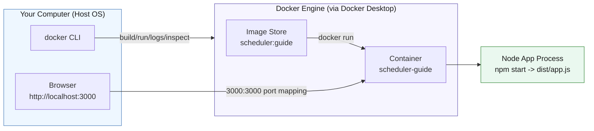
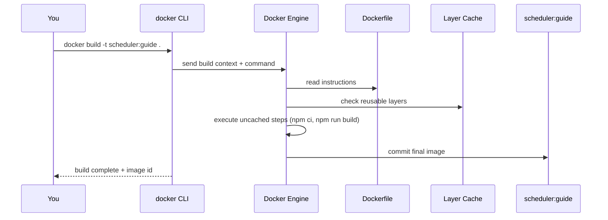

---
# try also 'default' to start simple
theme: default
background: https://cover.sli.dev
title: Docker Fundamentals for the Modular Monolith
info: |
  ## Docker Fundamentals
  Practical Docker workflow using this repo’s modular monolith.

  Build → Run → Inspect → Debug → Clean up
class: text-center
drawings:
  persist: false
transition: slide-left
mdc: true
duration: 45min
lineNumbers: true
highlighter: shiki
---

# Docker Fundamentals

## For the Modular Monolith

Build. Run. Inspect. Debug. Clean.

<div class="text-sm opacity-70 mt-6">
Repo: scheduling-app · Image: <code>scheduler:guide</code>
</div>

---

# Why Docker Exists (and What It Is Not)

- **Problem it solves**: “Works on my machine” → consistent, reproducible environments
- **What it is**: packaging + runtime for containers
- **What it is NOT**: a full virtual machine (containers share the host kernel)
- **Why teams use it**: faster builds, simpler deploys, predictable runtime

Scalability connection:

- same image → many identical containers
- easy to scale horizontally with orchestration later (Compose/Kubernetes)

---

# Learning Goals

By the end, you can:

- Explain Docker vs image vs container
- Build this repo into an image
- Run the container with ports + env
- Inspect state, logs, processes
- Debug a failing container
- Clean up images/containers safely

---

# What Docker Is (Working Model)

- **Docker**: tooling + runtime for containers
- **Image**: immutable blueprint (filesystem + metadata)
- **Container**: running instance of an image
- **Dockerfile**: recipe to build an image
- **Registry**: remote image store (Docker Hub)

Key mental split:

- **Image is not running**
- **Container is running**

---

# Mental Model Diagram



What to notice:

- CLI talks to Docker Engine, not directly to the app
- Images are stored; containers are running processes
- Port mapping bridges host traffic to the container

---
layout: two-cols
layoutClass: gap-12
---

# Key Definitions

- **Docker**: build/run containers
- **Image**: immutable packaged blueprint
- **Container**: running instance
- **Dockerfile**: build recipe
- **Registry**: remote image store
- **Port mapping**: host → container

::right::

# Common Confusion

- Image ≠ running
- Container = running
- Same image → many containers

Examples:

- `scheduler:guide` (image)
- `scheduler-guide` (container)

---
layout: two-cols
layoutClass: gap-8
---

# This Repo’s Docker Setup

```dockerfile {|1|2|3|4|5|6|7|8}
FROM node:24.13.0-alpine3.23
WORKDIR /app
COPY package.json package-lock.json ./
RUN npm ci
COPY . .
RUN npm run build
EXPOSE 3000
CMD ["npm", "start"]
```

::right::

<div class="text-sm opacity-70 mb-4">
Key files: <code>Dockerfile</code>, <code>package.json</code>, <code>.env</code>
</div>

<div class="relative min-h-[200px]">
  <div class="absolute inset-0" v-show="$slidev.nav.clicks === 1">
   <strong>FROM</strong> sets the base image: Node 24 on Alpine.
   <p class="text-sm text-gray-500 mt-2">
     LTS gives long support; Alpine keeps images small for faster builds and a
     smaller attack surface. <a href="https://docs.docker.com/reference/dockerfile/#from" target="_blank">FROM docs</a>
   </p>
  </div>
  <div class="absolute inset-0" v-show="$slidev.nav.clicks === 2">
   <strong>WORKDIR</strong> creates/sets <code>/app</code> as the working folder.
   <p class="text-sm text-gray-500 mt-2">
     Keeps paths consistent for COPY/RUN and avoids long absolute paths. <a href="https://docs.docker.com/reference/dockerfile/#workdir" target="_blank">WORKDIR docs</a>
   </p>
  </div>
  <div class="absolute inset-0" v-show="$slidev.nav.clicks === 3">
   <strong>COPY package*.json</strong> enables cached dependency installs.
   <p class="text-sm text-gray-500 mt-2">
     Separate dependency layer means rebuilds are fast when only app code changes. <a href="https://docs.docker.com/reference/dockerfile/#copy" target="_blank">COPY docs</a>
   </p>
  </div>
  <div class="absolute inset-0" v-show="$slidev.nav.clicks === 4">
   <strong>RUN npm ci</strong> installs exact deps from the lockfile.
   <p class="text-sm text-gray-500 mt-2">
     Reproducible installs using <code>package-lock.json</code>. <a href="https://docs.npmjs.com/cli/v10/commands/npm-ci" target="_blank">npm ci docs</a>
   </p>
  </div>
  <div class="absolute inset-0" v-show="$slidev.nav.clicks === 5">
   <strong>COPY . .</strong> brings in the full source code.
   <p class="text-sm text-gray-500 mt-2">
     This comes after deps so code changes don’t bust the install cache. <a href="https://docs.docker.com/reference/dockerfile/#copy" target="_blank">COPY docs</a>
   </p>
  </div>
  <div class="absolute inset-0" v-show="$slidev.nav.clicks === 6">
   <strong>RUN npm run build</strong> compiles TypeScript to <code>dist</code>.
   <p class="text-sm text-gray-500 mt-2">
     Produces the runtime JS that <code>npm start</code> executes. <a href="https://www.typescriptlang.org/docs/handbook/compiler-options.html" target="_blank">TypeScript build</a>
   </p>
  </div>
  <div class="absolute inset-0" v-show="$slidev.nav.clicks === 7">
   <strong>EXPOSE 3000</strong> documents the app’s port.
   <p class="text-sm text-gray-500 mt-2">
     Doesn’t publish ports by itself; it’s metadata for tooling. <a href="https://docs.docker.com/reference/dockerfile/#expose" target="_blank">EXPOSE docs</a>
   </p>
  </div>
  <div class="absolute inset-0" v-show="$slidev.nav.clicks === 8">
   <strong>CMD</strong> starts the app with <code>npm start</code>.
   <p class="text-sm text-gray-500 mt-2">
     Default command for the container; can be overridden at runtime. <a href="https://docs.docker.com/reference/dockerfile/#cmd" target="_blank">CMD docs</a>
   </p>
  </div>
</div>

---

# Why Copy package\*.json First?

Docker builds in layers.

If dependencies don’t change, the install step stays cached and rebuilds are
faster.

Why it matters:

- **Fast feedback** during development
- **Smaller rebuild scope** when only code changes

```text
Layer 1: FROM node:24.13.0-alpine3.23
Layer 2: COPY package*.json
Layer 3: RUN npm ci   ✅ cached if lockfile unchanged
Layer 4: COPY src
Layer 5: RUN npm run build
```

---

# Verify Docker Is Ready

Run:

```bash
docker --version
docker context ls
docker info
```

What you’re checking:

- CLI exists (`--version`)
- active engine target (`context ls`)
- daemon reachable (`info`)

If `docker info` fails, Docker Desktop (daemon) is not running yet.

---

# Demo: Docker Ready Check

This recording shows the three sanity checks: CLI, context, daemon.

<Asciinema src="/casts/01-docker-ready-check.cast" theme="dracula" />

---

# Build the Image

From repo root:

```bash
docker build -t scheduler:guide .
```

What it does:

- Reads `Dockerfile`
- Sends build context (`.`)
- Produces image `scheduler:guide`

Important:

- **Build context** is everything under `.` — keep it small with `.dockerignore`.

---

# Demo: Build the Image

Watch the build steps run and observe cached layers on rebuilds.

<Asciinema src="/casts/02-build-image.cast" theme="dracula" />

---

# Build Sequence (Conceptual)



Takeaway:

- Docker executes the Dockerfile step‑by‑step
- Cached layers skip work when inputs don’t change

---
layout: two-cols
layoutClass: gap-12
---

# Image Inventory

```bash
docker image ls
docker image ls scheduler:guide
```

<strong>Look for:</strong>

- Repository + tag
- Image ID
- Size

<div class="bg-blue-100 text-blue-900 p-4 rounded-lg shadow-md border-l-4 border-blue-500 mt-13">  
  <p>You can use the tag or the image ID to reference the image in commands.</p>
</div>

::right::

# Example Output

```text
REPOSITORY   TAG    IMAGE ID       CREATED          SIZE
scheduler    guide  1a2b3c4d5e6f   2 minutes ago    245MB
```

<strong>Headers explained:</strong>

- **REPOSITORY**: image name (e.g., `scheduler`)
- **TAG**: version label (e.g., `guide`, `latest`)
- **IMAGE ID**: unique image identifier
- **CREATED**: how long ago the image was built
- **SIZE**: disk space used by the image

---

# Run the App Container

```bash
docker run --name scheduler-guide --env-file .env -p 3000:3000 scheduler:guide
```

Flags:

- `--name`: stable container name
- `--env-file .env`: load env vars
- `-p 3000:3000`: host → container

Important:

- `.env` stays local (don’t commit secrets)
- `-p` is required to access the app from your browser

---

# In‑Class Activity (6 minutes)

Create a tiny Dockerfile, build it, and run it.

Steps:

1. `mkdir docker-mini && cd docker-mini`
2. Create a `Dockerfile` with:

```dockerfile
FROM alpine:3.19
CMD ["echo", "Hello from my first container!"]
```

3. Build the image:

```bash
docker build -t hello-docker .
```

4. Run the container:

```bash
docker run --rm hello-docker
```

Submit to Canvas:

- A screenshot showing your Dockerfile and the `docker run` output.

---
layout: two-cols
layoutClass: gap-12
---

# Port Mapping Explained

`-p host:container`

- Host `3000` forwards to container `3000`
- Browser hits `localhost:3000`
- Container app listens on `3000`

Key points:

- Port mapping is **explicit** — without `-p`, the app is isolated
- You can change the host port (`-p 3001:3000`) if 3000 is busy
- The container still listens on its internal port (`3000`)

::right::

<div class="border rounded p-4 text-sm">
<strong>Flow</strong>

Browser → Host 3000 → Docker Engine → Container 3000

<div class="text-xs opacity-70 mt-2">
Think of this like a map key in data structures: the host port is the “public key”
you look up, and Docker forwards (maps) it to the container’s private port where
the app actually lives.
</div>

</div>

<p>In practice, this is why you can run multiple containers of the same app on a
single machine, each one can keep its internal port (3000) while you choose
different host ports (3001, 3002, 3003) to reach them.</p>

<div class="text-blue-100 text-blue-900 p-4 rounded-lg shadow-md border-l-4 border-red-500 mt-6">
<p>This turns out to be extremely useful when you start running multiple instances 
of the same service for load testing or scaling. We will look at this later.</p>
</div>

---

# Validate the App

Validate the app is running by visiting:

- [http://localhost:3000](http://localhost:3000)
- [http://localhost:3000/health](http://localhost:3000/health)

<strong>Health Response:</strong>

```json
{ "ok": true }
```

<div class="text-sm opacity-70 mt-2">
This response is short, but meaningful. In real systems, the response would
include more details (e.g., database status), but the key is that 
it’s a **machine‑readable check** that says “this service is alive.”


Why `/health` matters:

- It’s a **machine‑readable check** that says “this service is alive.”
- In multi‑service systems, orchestrators and load balancers use health checks
  to decide which containers should receive traffic.
- If a container fails its health check, it can be restarted automatically.

If `/health` fails, check logs and port mapping first.

</div>

---

# Container Lifecycle

```bash
docker stop scheduler-guide
docker start scheduler-guide
docker rm scheduler-guide
```

One-step force remove:

```bash
docker rm -f scheduler-guide
```

Tip: use `stop` + `rm` in normal workflows; `rm -f` is for quick resets.

---
layout: two-cols
layoutClass: gap-12
---

# Inspect Running State

```bash
docker ps
docker ps -a
```

Use:

- `ps`: running containers
- `ps -a`: all containers

::right::

# Read the Columns

- CONTAINER ID
- IMAGE
- STATUS
- PORTS
- NAMES

Use the container **name** for logs/inspect/exec commands.

---

# View Logs

```bash
docker logs scheduler-guide
docker logs -f scheduler-guide
```

When to use:

- `logs`: quick snapshot
- `logs -f`: live stream while testing

Tip: stop `-f` with `Ctrl+C` (container keeps running).

---

# Inspect Metadata

```bash
docker inspect scheduler-guide

docker inspect scheduler-guide --format '{{.State.Status}}'
docker inspect scheduler-guide --format '{{json .NetworkSettings.Ports}}'
```

Use to confirm:

- container state
- port publishing
- mounts + env

The formatted `inspect` is the fastest way to verify port bindings.

---

# Exec Into the Container

```bash
docker exec -it scheduler-guide sh
```

Inside, useful checks:

```bash
pwd
ls
cat package.json
ls dist
exit
```

Tip: `sh` works for Alpine images; use `bash` only if installed.

---
layout: two-cols
layoutClass: gap-12
---

# Process & Resource Visibility

```bash
docker top scheduler-guide
docker stats scheduler-guide
```

Use:

- `top`: processes
- `stats`: CPU/memory/network

Watch for unexpected processes or CPU spikes.

::right::

# Example Snippet

```text
CONTAINER ID   NAME             CPU %   MEM USAGE / LIMIT
1a2b3c4d5e6f   scheduler-guide  0.05%   45MiB / 7.7GiB
```

---

# Debugging Workflow (Do This Order)

1. Is it running?
   - `docker ps -a`
2. If exited, why?
   - `docker logs <name>`
3. Port published?
   - `docker inspect <name> --format '{{json .NetworkSettings.Ports}}'`
4. App healthy?
   - `http://localhost:3000/health`
5. Need deeper check?
   - `docker exec -it <name> sh`

This flow fixes most “container won’t start” issues quickly.

---
layout: two-cols
layoutClass: gap-12
---

# Cleanup Commands (Use Carefully)

```bash
docker container prune
docker image prune
docker system prune -a
```

Warnings:

- `prune` deletes unused resources
- `system prune -a` is aggressive

Always read the prompt before confirming a prune.

::right::

# When to Use

- After a tutorial/lab
- When disk usage grows
- Never when you need old images

---

# Common Mistakes & Fixes

**Port is already allocated**

```bash
docker run --name scheduler-guide --env-file .env -p 3001:3000 scheduler:guide
```

**Cannot connect to the Docker daemon**

- Start Docker Desktop, retry `docker info`

**No such image**

- Run `docker image ls` to confirm tags

Tip: image names are `repository:tag` (e.g., `scheduler:guide`).

---

# Mini Lab (Proficiency Check)

1. Build image `scheduler:lab`
2. Run `scheduler-lab` on `3000:3000`
3. Verify `/health`
4. `docker exec -it` into container
5. Follow logs with `docker logs -f`
6. Stop and remove container
7. Remove image

If you can do this from memory, you’re Docker‑ready.

Bonus: repeat with a different tag to prove you understand image naming.

---
layout: two-cols
layoutClass: gap-12
---

# Résumé‑Ready Summary

You can now:

- Build and tag images
- Run containers with env + ports
- Inspect logs, state, ports
- Debug with `inspect` + `exec`
- Clean up safely

::right::

# Next Step

- Docker Compose
- Multi-container systems
- Service dependencies

Compose is the bridge from single‑container to real systems.

---

# Appendix: Useful Commands (Quick Reference)

```bash
# Build + run
docker build -t scheduler:guide .
docker run --name scheduler-guide --env-file .env -p 3000:3000 scheduler:guide

# Inspect
docker ps
docker logs -f scheduler-guide
docker inspect scheduler-guide --format '{{.State.Status}}'
docker exec -it scheduler-guide sh

# Cleanup
docker stop scheduler-guide
docker rm scheduler-guide
docker image rm scheduler:guide
```
