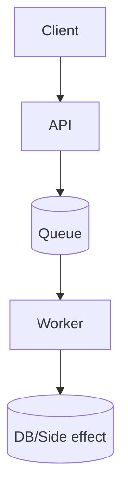
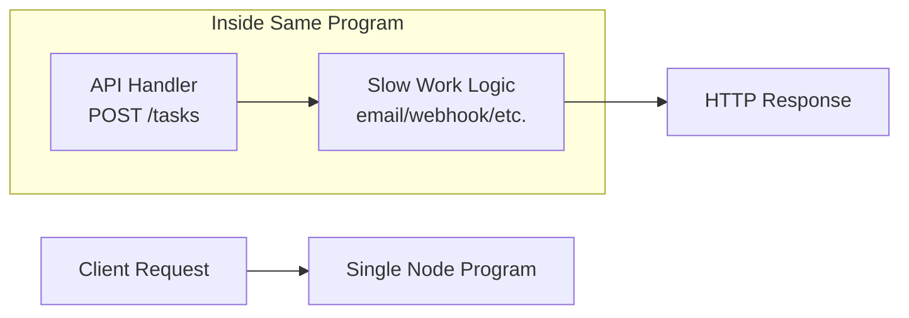
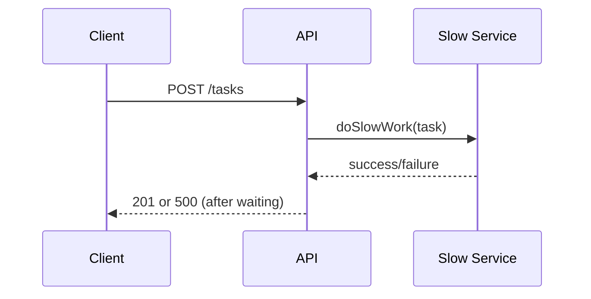
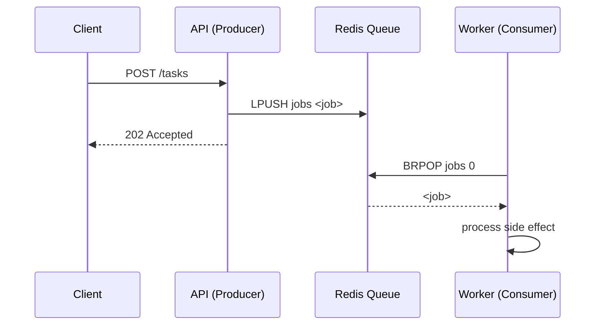
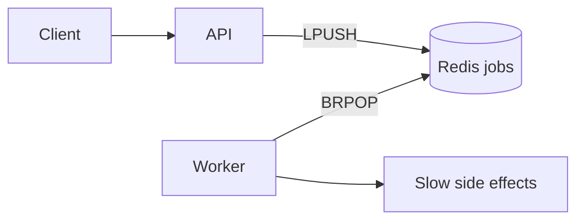
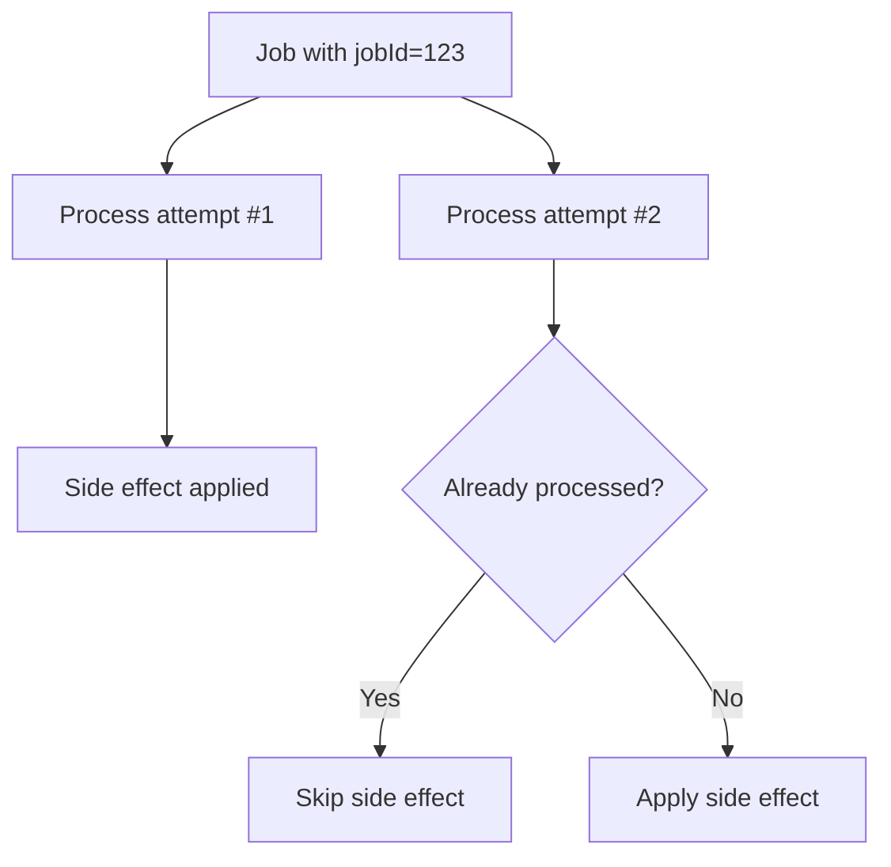

# 09 Decoupling

<div class="text-2xl opacity-70 mt-6">
Move slow and failure-prone work off the request path
</div>

---
class: text-2xl
---

# Class Format (Experiential)

Today is a tutorial-style class:

- Demo 1: synchronous pain points
- Mini-lecture 1: Redis queue primer (mental model + operations)
- Activity 1 (10 min): add queue + worker
- Debrief + mini-lecture 2: failure isolation and reliability patterns
- Demo 2: duplicates under at-least-once delivery
- Activity 2 (10 min): add idempotency guard
- Wrap-up: connect architecture to reliability tradeoffs

---
class: text-xl
layout: two-cols 
layoutClass: gap-12
---

# Outcomes

By end of class, you should be able to:

- Introduce a dedicated background worker
- Use queue-based producer/consumer communication
- Isolate request-path failures from async job failures
- Explain at-least-once delivery and why idempotency is required

::right::



---
class: text-2xl
---

# Where We Left Off

Last lecture (resilience):

- health/readiness
- retries/backoff
- startup stability

Today adds a new layer:

- even if startup is healthy, request latency and coupling can still be bad
- decoupling lets the API stay responsive while work happens asynchronously

---
class: text-xl
layout: two-cols-header
layoutClass: gap-x-12 gap-y-0 no-wrap-header cols-50-50
---

# Previous System (Before Decoupling)

::left::

In the previous version, everything lived in one program:

- the API endpoint and work logic ran in the same Node process
- when a request came in, that same process did slow side-effect work immediately
- if the side-effect code failed, the request failed too

**Simple way to think about it:**
- one app, one runtime, one failure domain

::right::

<div class="min-h-[380px] grid place-items-center scale-155">



</div>

---
class: text-2xl
layout: two-cols-header
layoutClass: gap-10 no-wrap-header
---

# Before vs After

::left::

### **Before (coupled)**

- `POST /tasks` does everything inline
- request waits for slow I/O
- worker logic crash == request failure

::right::

### **After (decoupled)**

- `POST /tasks` enqueues job, returns quickly
- worker consumes jobs independently
- worker crash does not crash request path

---
class: text-2xl
---

# Demo 1: The Coupled Baseline

Goal: feel the pain before we fix it.

**Demo behavior:**

- request handler sleeps or does slow dependency call
- occasional failure inside that work
- client sees high latency and intermittent 500s

**Question before we run it:**

- If this endpoint gets 20 concurrent requests, what happens to user experience?

---
class: text-xl code-size-sm
---

# Demo 1 Code: Inline Work in API

```js
app.post('/tasks', async (req, res) => {
  try {
    const task = req.body

    // Simulate slow side effect (email, invoice, webhook, etc.)
    await doSlowWork(task) // 2-4 seconds, sometimes throws

    res.status(201).json({ ok: true })
  } catch (err) {
    res.status(500).json({ ok: false, error: 'task failed inline' })
  }
})
```

**Why this is fragile:**

- user waits for slow work
- transient side-effect failures become request failures

---
class: text-2xl
---

# Demo 1 Commands

Use the mini-lecture stack (no host `curl` required):

- `cd code/09-decoupling/mini-lecture-1`
- `docker compose up --build -d`
- `docker compose run --rm demo baseline-observe`
- `docker compose run --rm demo baseline-load 12 4`

Then compare relief:

- `docker compose run --rm demo relief-observe`
- `docker compose run --rm demo relief-load 24 8`
- `docker compose logs -f worker`

---
class: text-2xl
---

# Command Walkthrough: Setup

Command:

- `cd code/09-decoupling/mini-lecture-1`

What it does:

- moves your shell into the demo folder
- ensures all following `docker compose` commands use the right stack

Setup in that folder:

- `api-baseline` on port `3000` (inline slow work)
- `api-relief` on port `3002` (queue + fast `202`)
- `worker` + `redis`
- `demo` runner service for curl/load commands

---
class: text-2xl
---

# Command Walkthrough: Start Services

Command:

- `docker compose up --build -d`

What it does:

- builds images from local `api/`, `worker/`, and `demo-runner/`
- starts containers in detached mode
- initializes Redis and network wiring between services

What to verify:

- no container exits immediately
- services are reachable before running demo commands

---
class: text-2xl
---

# Command Walkthrough: Baseline Observe

Command:

- `docker compose run --rm demo baseline-observe`

What it does:

- runs one POST request against `api-baseline`
- prints HTTP status + request latency + JSON response

What to notice:

- latency is usually multi-second
- result can be `201` or `500` depending on simulated failure
- this is the synchronous pain case

---
class: text-2xl
---

# Command Walkthrough: Baseline Load

Command:

- `docker compose run --rm demo baseline-load 12 4`

What it does:

- sends 12 baseline requests with concurrency 4
- summarizes status counts and latency stats

How to read output:

- higher `latency_avg_s` shows request-path blocking
- `status_500` indicates transient side-effect failures leaking to clients

---
class: text-2xl
---

# Command Walkthrough: Relief Observe

Command:

- `docker compose run --rm demo relief-observe`

What it does:

- sends one POST to `api-relief` (queued mode)
- API enqueues and quickly returns `202` with a `jobId`
- demo then polls job status to show async completion

What to notice:

- request latency should be near-instant compared to baseline
- work still happens, but outside request path

---
class: text-2xl
---

# Command Walkthrough: Relief Load

Command:

- `docker compose run --rm demo relief-load 24 8`

What it does:

- sends 24 requests with concurrency 8 to queued API
- reports response latency and accepted jobs
- shows queue depth after enqueues

What to notice:

- responses stay fast (`202`) under burst
- backlog moves to queue instead of user-facing latency

---
class: text-2xl
---

# Command Walkthrough: Worker Logs

Command:

- `docker compose logs -f worker`

What it does:

- streams worker processing logs in real time
- shows queued jobs being drained and processed

What to connect:

- API latency is now decoupled from side-effect runtime
- this is the core architecture shift: request path vs async work path

---
class: text-2xl
layout: two-cols-header
layoutClass: gap-10 no-wrap-header
---

# Demo 1 Debrief

::left::

<Callout title="Main takeaway" tone="warning">
Fast API responses and slow side effects do not belong in the same failure domain.
</Callout>

::right::

What we observed:

- slow work inflated response time
- request success depended on side-effect timing
- retries at client could duplicate work

---
class: text-2xl
layout: two-cols-header
layoutClass: gap-10 no-wrap-header
---

# Mini Lecture 1: Communication Models

::left::

### **Synchronous (request/response)**

- API calls dependency inline
- caller waits for full completion
- one slow dependency stretches user latency
- failure propagates directly to caller

::right::

### **Queue-based (producer/consumer)**

- API enqueues a job, returns fast
- worker processes job separately
- queue buffers bursts and downtime
- request path and work path fail independently

---
class: text-xl
---

# Synchronous Path (Coupled Timeline)

<div class="w-3/4 mx-auto">



</div>

- User latency includes slow side effect.
- Side-effect failure becomes request failure.

---
class: text-xl
---

# Queue Path (Decoupled Timeline)

<div class="w-2/3 mx-auto">



</div>

- Fast response to client.
- Slow/failed work handled off request path.

---
class: text-2xl 
layout: two-cols-header
layoutClass: mt-gap-4 gap-x-12
---

# Redis Queue Basics (Lists)

We will use one Redis list key: `jobs`.

::left::

**Core Operations:**

- `LPUSH jobs <json>` -> add a new job
- `BRPOP jobs 0` -> blocking pop from queue (wait forever)
- `LLEN jobs` -> queue depth
- `LRANGE jobs 0 -1` -> inspect current queue items

::right::

**FIFO Pattern Used in Class:**

- producer uses `LPUSH`
- worker uses `BRPOP`
- oldest item is consumed first

---
class: text-xl code-size-sm
---

# Redis CLI Queue Demo

```bash
# 1) Enter Redis CLI in compose
docker compose exec redis redis-cli

# 2) Enqueue two jobs
LPUSH jobs '{"jobId":"1","task":"email"}'
LPUSH jobs '{"jobId":"2","task":"email"}'

# 3) Inspect queue
LLEN jobs
LRANGE jobs 0 -1

# 4) Consume one job (blocks until available)
BRPOP jobs 0
```

What to notice:

- Queue stores plain strings.
- Your app serializes/deserializes JSON.

---
class: text-xl code-size-sm
---

# Node + Redis Queue Operations

```js
import redis from 'redis'

const client = redis.createClient({ url: 'redis://redis:6379' })
await client.connect()

// Producer
await client.lPush('jobs', JSON.stringify(job))

// Consumer (blocking)
const result = await client.brPop('jobs', 0)
const job = JSON.parse(result.element)
```

**Implementation rule for today:**

- API file only enqueues and returns `202`
- worker file only dequeues and processes jobs

---
layout: two-cols-header
layoutClass: gap-8 compact-header
class: text-lg
---

## Activity 1 (10 minutes): Introduce Queue + Worker

::left::

**Work in pairs. Keep your current app, then:**

1. Add a queue (Redis list is fine).
2. Change `POST /tasks` to enqueue only.
3. Return `202 Accepted` with a `jobId`.
4. Add a `worker` process that consumes and processes jobs.

Use folder: `code/09-decoupling/activity-1`

::right::

**Minimum behavior to show:**

- API returns quickly even when work is slow.
- Worker logs job processing separately.
- If worker is stopped, API can still enqueue.

Checkpoint command set:

- `docker compose up -d --build`
- `docker compose logs -f api worker`

**A more complete description of the activity is available with the activity assignment.**

---
class: text-2xl
---

# Activity 1 Hints

Possible Redis queue commands:

- enqueue: `LPUSH jobs <json>`
- consume: `BRPOP jobs 0`

Minimal API response shape:

```json
{ "accepted": true, "jobId": "abc123", "status": "queued" }
```

If stuck, implement these two files first:

- `api/server.js` enqueue endpoint
- `worker/worker.js` consumer loop

---
class: text-center
---

# Activity 1 Work Time

<ActivityCountdown
  :minutes="15"
  label="15-minute countdown"
  goal="Goal: API returns 202, worker consumes queue, and behavior improves under load."
/>

---
class: text-2xl
---

# Debrief: What Changed Architecturally?



- API became a producer.
- Worker became a consumer.
- Queue became the boundary between request path and async work.

---
class: text-2xl
---

# Mini Lecture: Queue Patterns

Core pattern terms:

- **Producer**: creates jobs and enqueues
- **Consumer/Worker**: dequeues and processes
- **Visibility/failure window**: where duplicates can occur
- **Retry strategy**: when processing fails

Important truth:

- Real systems often provide at-least-once delivery, not exactly-once.

---
class: text-2xl code-size-sm
---

# Live Coding Pattern: API as Producer

```js
app.post('/tasks', async (req, res) => {
  const jobId = crypto.randomUUID()
  const job = { jobId, type: 'send-email', payload: req.body }

  await redis.lPush('jobs', JSON.stringify(job))

  res.status(202).json({
    accepted: true,
    jobId,
    status: 'queued',
  })
})
```

Design note:

- `202` means accepted for async processing, not completed.

---
class: text-xl
---

# Live Coding Pattern: Worker as Consumer

```js
while (true) {
  const result = await redis.brPop('jobs', 0)
  const raw = result?.element
  if (!raw) continue

  const job = JSON.parse(raw)
  await processJob(job)
  console.log('processed', job.jobId)
}
```

This loop is simple, but the hard part is failure behavior.

---
class: text-2xl code-size-sm
---

# Compose Update (Worker Service)

```yaml
services:
  api:
    build: ./api
    depends_on:
      redis:
        condition: service_healthy

  worker:
    build: ./worker
    depends_on:
      redis:
        condition: service_healthy

  redis:
    image: redis:7-alpine
```

Now API and worker can fail/restart independently.

---
class: text-xl
---

# Demo 2: Duplicate Delivery vs Idempotency

Use folder: `code/09-decoupling/mini-lecture-2`

Run this sequence:

1. `docker compose up --build -d`
2. `docker compose run --rm demo no-idem-observe`
3. `docker compose run --rm demo idem-observe`
4. `docker compose run --rm demo no-idem-load 8 2`
5. `docker compose run --rm demo idem-load 8 2`

**Expected observation:**

- no-idem pipeline repeats side effects for duplicate submissions
- idem pipeline keeps side effects near one per unique `jobId`

---
class: text-2xl
layout: two-cols-header
layoutClass: gap-12 no-wrap-header gap-x-12 gap-y-0
---

# At-Least-Once: Where Duplicates Happen

::left::

**Potential failure window:**

1. worker pops job
2. side effect succeeds (email sent)
3. worker crashes before recording success
4. job is retried

::right::

**Consequence:**

- external side effect may happen twice
- this is not rare; it is expected in distributed systems

<Callout class="mt-4" title="Design implication" tone="warning">
If retries are possible, handlers must be idempotent.
</Callout>

---
class: text-xl
layout: two-cols
layoutClass: gap-x-20 gap-y-0 no-wrap-header
---

# What is Idempotency?

::left::

**Definition (plain English):**

Running the same operation multiple times has the same final effect as running it once.

**Examples:**

- setting a profile name to `"Alex"` is idempotent
- charging a credit card twice is **not** idempotent

**In our class context:**

- processing the same `jobId` twice should not produce two side effects

::right::

<div class="origin-center scale-90">



</div>

At-least-once delivery means duplicates are possible, so idempotency protects correctness.

---
class: text-2xl
---

# Idempotency Strategy

Goal: repeated processing of same job should have same end result.

**Practical patterns:**

- include stable idempotency key (`jobId`)
- check/store processed status before side effect
- skip if already processed
- make side-effect writes conditional when possible

**Redis option:**

- key: `processed:<jobId>`
- claim once with `SET processed:<jobId> 1 NX EX 86400`

---
class: text-base code-size-sm mt-0
---

# Worker Guard Example (Idempotent)

```js
async function processJobIdempotent(job) {
  const lockKey = `processed:${job.jobId}`
  const claimed = await redis.set(lockKey, '1', { NX: true, EX: 86400 })

  if (!claimed) {
    console.log('duplicate skipped', job.jobId)
    return
  }

  await sendEmail(job.payload)
  await db.insertJobAudit({ jobId: job.jobId, status: 'done' })
}
```

---
class: text-base code-size-sm mt-0
---

# Worker Guard Example (Idempotent)

```js
  const claimed = await redis.set(lockKey, '1', { NX: true, EX: 86400 })
```

What this line does:

- `lockKey` -> unique key for this job (for example `processed:abc123`)
- `'1'` -> marker value meaning "already claimed/processed"
- `NX: true` -> set key **only if it does not already exist**
- `EX: 86400` -> expire key in 86,400 seconds (24 hours)

How to read `claimed`:

- truthy -> first processor wins, run side effect
- falsy -> duplicate delivery, skip side effect

---
layout: two-cols-header
layoutClass: gap-8 compact-header
class: text-lg
---

## Activity 2 (10 minutes): Add Idempotency + Test It

::left::

Implement in your worker:

1. Use `jobId` as idempotency key.
2. Add Redis `SET NX` claim guard.
3. Log `duplicate skipped` for repeats.

Use folder: `code/09-decoupling/activity-2`

Then simulate duplicate delivery:

- enqueue same `jobId` twice
- or re-run same payload with same id

::right::

Verify:

- side effect executes once
- second attempt is skipped
- logs clearly show one processed + one skipped

Suggested commands:

- `docker compose run --rm demo duplicate-observe`
- `docker compose run --rm demo duplicate-load 8 2`
- `docker compose logs -f worker`
- `docker compose exec redis redis-cli KEYS 'processed:*'`

---
class: text-2xl
---

# Quick Share-Out

With your partner, answer:

1. What changed when worker was down?
2. Where did you enforce idempotency?
3. What evidence showed duplicate protection worked?

Be ready to show one terminal output snippet.

---
class: text-2xl
---

# Tradeoff Table

| Design choice | Benefit | Cost |
| --- | --- | --- |
| Inline sync processing | Simple control flow | Latency + coupled failures |
| Queue + worker | Fast requests + isolation | More moving parts |
| At-least-once retries | Better eventual completion | Possible duplicates |
| Idempotency keys | Safe retries | Extra state and logic |

---
class: text-2xl
---

# Recap

Today you practiced:

- introducing a dedicated worker
- queue-based producer/consumer communication
- isolating request path from async failures
- making at-least-once processing safe with idempotency

If you can explain why `202 + queue + idempotent worker` is safer than inline side effects, you got the core idea.

---
class: text-2xl
---

# The End

Until Next Time...