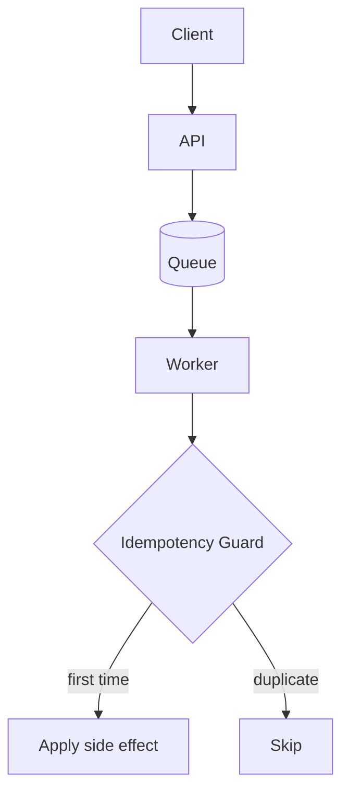
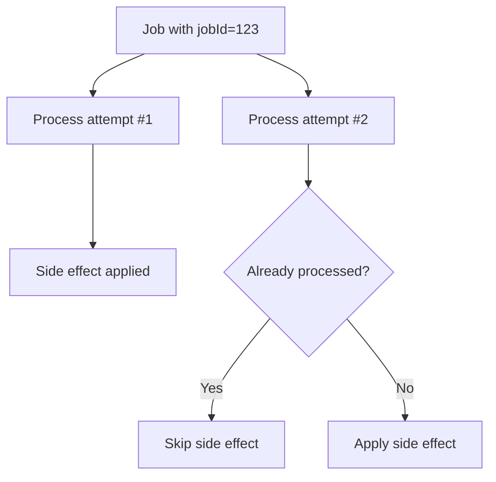

# 10 Idempotency

<div class="text-2xl opacity-70 mt-6">
Prevent duplicate business side effects under retries and redelivery
</div>

---
class: text-2xl
---

# Class Format (Experiential)

Today is a tutorial-style class:

- Quick recap: queue + worker decoupling
- Demo 1: duplicate delivery problem (no idempotency)
- Mini-lecture: at-least-once delivery and correctness
- Activity (10 min): add idempotency guard in worker
- Demo 2: compare before/after under load
- Wrap-up: tradeoffs and production checklist

---
class: text-xl
layout: two-cols
layoutClass: gap-12
---

# Outcomes

By end of class, you should be able to:

- Explain why retries imply duplicate processing risk
- Define idempotency for async job handlers
- Implement a Redis `SET NX` idempotency guard
- Validate that duplicate deliveries do not repeat side effects

::right::



---
class: text-xl
layout: two-cols-header
layoutClass: gap-10 no-wrap-header
---

# Recap: Why This Lecture Exists

::left::

Last lecture (09 decoupling):

- API moved slow work off request path
- queue buffered bursts and downtime
- worker processed jobs asynchronously

::right::

What remained unsolved:

- retries and crashes can re-deliver the same logical job
- side effects can happen more than once
- correctness now requires idempotency

---
class: text-xl
---

# Demo 1: Duplicate Delivery vs Idempotency

Use folder: `code/10-idempotency/mini-lecture-2`

Run this sequence:

1. `docker compose up --build -d`
2. `docker compose run --rm demo no-idem-observe`
3. `docker compose run --rm demo idem-observe`
4. `docker compose run --rm demo no-idem-load 8 2`
5. `docker compose run --rm demo idem-load 8 2`

Expected observation:

- no-idem pipeline repeats side effects for duplicate submissions
- idem pipeline stays near one side effect per unique `jobId`

---
class: text-2xl
layout: two-cols-header
layoutClass: gap-12 no-wrap-header gap-x-12 gap-y-0
---

# At-Least-Once: Where Duplicates Happen

::left::

Potential failure window:

1. worker pops job
2. side effect succeeds (email sent)
3. worker crashes before recording success
4. job is retried

::right::

Consequence:

- external side effect may happen twice
- this is expected in distributed systems

<Callout class="mt-4" title="Design implication" tone="warning">
If retries are possible, handlers must be idempotent.
</Callout>

---
class: text-xl
layout: two-cols
layoutClass: gap-x-20 gap-y-0 no-wrap-header
---

# What Is Idempotency?

::left::

Definition (plain English):

Running the same operation multiple times has the same final effect as running it once.

Examples:

- setting a profile name to `"Alex"` is idempotent
- charging a credit card twice is not idempotent

In this class:

- processing the same `jobId` twice should not produce two side effects

::right::

<div class="origin-center scale-90">



</div>

---
class: text-2xl
---

# Idempotency Strategy

Goal: repeated processing of same job should have same end result.

Practical patterns:

- include stable idempotency key (`jobId`)
- claim once before side effect
- skip if already claimed/processed
- keep claim TTL aligned to retry horizon

Redis option:

- key: `processed:<pipeline>:<jobId>`
- claim once with `SET key 1 NX EX 86400`

---
class: text-base code-size-sm mt-0
---

# Worker Guard Example (Idempotent)

```js
async function processJobIdempotent(job) {
  const lockKey = `processed:${job.jobId}`
  const claimed = await redis.set(lockKey, '1', { NX: true, EX: 86400 })

  if (!claimed) {
    console.log('duplicate skipped', job.jobId)
    return
  }

  await sendEmail(job.payload)
  await db.insertJobAudit({ jobId: job.jobId, status: 'done' })
}
```

---
class: text-base code-size-sm mt-0
---

# Claim Guard Breakdown

```js
const claimed = await redis.set(lockKey, '1', { NX: true, EX: 86400 })
```

What this does:

- `lockKey`: unique key per logical job
- `NX: true`: only set if key does not exist
- `EX: 86400`: expire claim in 24h

How to read `claimed`:

- truthy: first processor wins, execute side effect
- falsy: duplicate delivery, skip side effect

---
layout: two-cols-header
layoutClass: gap-8 compact-header
class: text-lg
---

## Activity (10 minutes): Add Idempotency + Test It

::left::

Implement in your worker:

1. Use `jobId` as idempotency key.
2. Add Redis `SET NX` claim guard.
3. Log duplicate skip on repeat delivery.

Use folder: `code/10-idempotency/activity-2`

::right::

Verify:

- side effect executes once per unique `jobId`
- repeat attempts are skipped
- load test trends toward `unique_jobs` effects

Suggested commands:

- `docker compose run --rm demo duplicate-observe`
- `docker compose run --rm demo duplicate-load 8 2`
- `docker compose logs -f worker`
- `docker compose exec redis redis-cli KEYS 'processed:*'`

---
class: text-2xl
---

# Demo 2: Before/After Evidence

Show both outputs side-by-side:

- `no-idem-observe` vs `idem-observe`
- `no-idem-load` vs `idem-load`

Look for:

- same submission counts
- reduced observed side effects after guard
- explicit duplicate-skip log entries

---
class: text-2xl
---

# Tradeoff Table

| Design choice | Benefit | Cost |
| --- | --- | --- |
| At-least-once retries | Better eventual completion | Possible duplicates |
| Idempotency keys | Safe retries | Extra state and logic |
| Long claim TTL | Fewer duplicate side effects | More stale-key risk |
| Short claim TTL | Faster key cleanup | More duplicate risk |

---
class: text-2xl
---

# Production Checklist

Before shipping idempotent workers:

- choose stable idempotency key semantics
- define TTL from business retry window
- log `processed` and `duplicate-skipped` separately
- add dashboards for effect count vs submission count
- test crash/restart windows explicitly

---
class: text-2xl
---

# Recap

Today you practiced:

- identifying duplicate-delivery failure modes
- implementing `SET NX` idempotency claim guards
- verifying correctness under repeated submissions

If you can prove one side effect per `jobId` under retries, you got the core idea.

---
class: text-2xl
---

# The End

Until Next Time...
